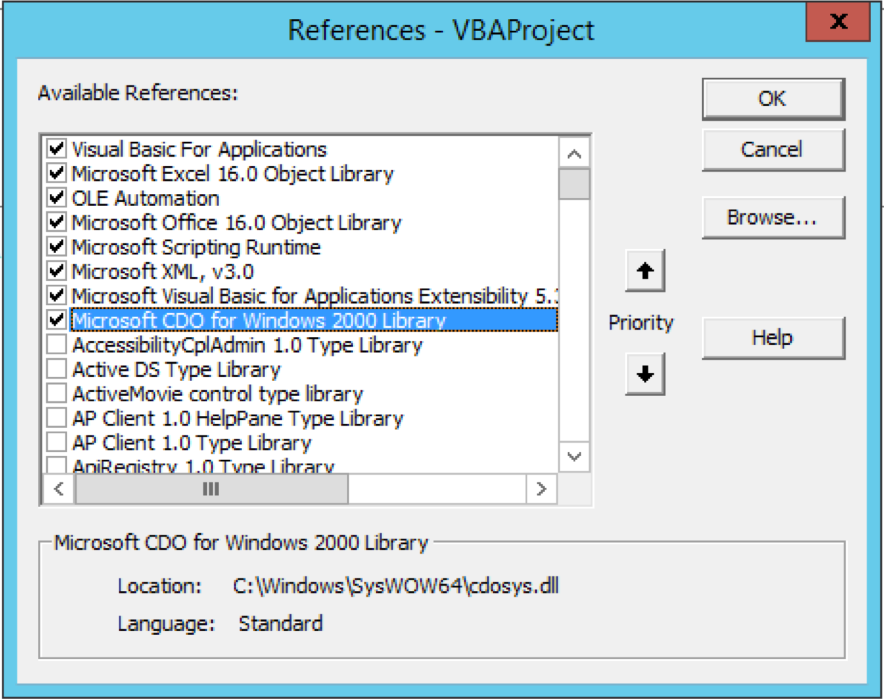

# Art Vandelay

He's an importer...and exporter.

Useful if you want to use git on your Excel/VBA projects.

## Setup

You'll need to update `ZIP_LOCATION` in `zip.bas`.

In the VBA menu bar, go to Tools => References:

